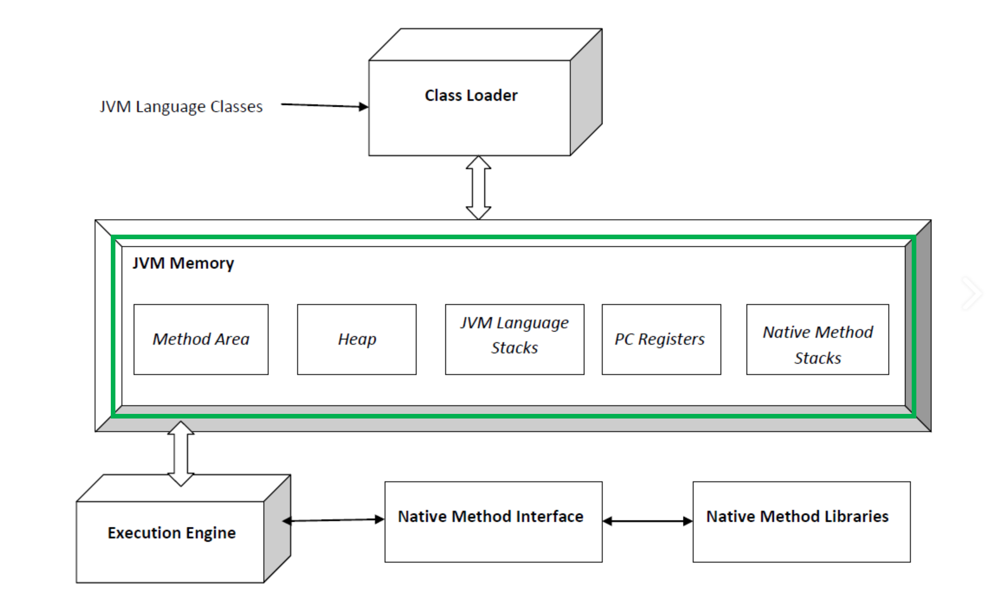

# 0. JVM의 Runtime Data Area 

이번 문서에서 정리하는 내용은 아래 그림에서 초록 테두리로 표시한 영역이다.

 

# 참고자료

- JVM 구조와 자바 런타임 메모리 구조 : [https://jeong-pro.tistory.com/148](https://jeong-pro.tistory.com/148)
- JAVA 8 이후의 HEAP 메모리 구조와 GC 알고리즘 : [https://1-7171771.tistory.com/140](https://1-7171771.tistory.com/140)
- JAVA 8 부터는 static 이 heap 영역에 저장된다? : [https://jgrammer.tistory.com/144](https://jgrammer.tistory.com/144)
- JEP 122: Remove the Permanent Generation : [https://openjdk.org/jeps/122](https://openjdk.org/jeps/122)
- Stack 과 Heap, 그리고 Garbate Collection : [https://medium.com/@lunay0ung/stack-vs-heap-a0a0fe5ec5ce](https://medium.com/@lunay0ung/stack-vs-heap-a0a0fe5ec5ce)
- JDK 8 에서 Perm 영역은 왜 삭제됐을까 : [https://johngrib.github.io/wiki/java8-why-permgen-removed/](https://johngrib.github.io/wiki/java8-why-permgen-removed/)
- [자바 트러블 슈팅](http://www.yes24.com/Product/Goods/84937877)
- G1GC : [https://www.oracle.com/technetwork/tutorials/tutorials-1876574.html](https://www.oracle.com/technetwork/tutorials/tutorials-1876574.html)
- The Java Virtual Machine Specification - 2.5 Runtime Data Area : [https://docs.oracle.com/javase/specs/jvms/se11/html/jvms-2.html#jvms-2.5](https://docs.oracle.com/javase/specs/jvms/se11/html/jvms-2.html#jvms-2.5)

 

# JVM 의 Runtime Data Area (JVM의 메모리 구조)

**JVM의 런타임 데이터 영역**(Runtime Data Area) 은 Method Area, 힙 영역, PC Register, Native Method Stack 으로 구성된다. 

요약해보면, JVM 의 런타임 데이터 영역(Runtime Data Area) 는 아래와 같은 요소들로 구성된다.

- Method Area
- 힙 영역
- PC Register
- Native Method Stack

  

> 참고) 
>
> - 스레드가 생성되었을 때 기준으로 메소드 영역(아래에 정리)과 힙 영역(아래에 정리)을 모든 스레드가 공유한다.
> - 스택영역과 PC레지스터, Native Method Stack 은 각각의 스레드마다 생성되고 공유되지 않는다.

 

## Method Area (메소드 영역)

- 필드 정보 : 클래스 멤버 필드명, 데이터 타입, 접근 제어자 등의 필드 정보
- 메서드 정보 : 메서드의 이름, 리턴 타입, 파라미터, 접근 제어자 등의 메서드 정보
- Type 정보 : interface 인지, class 인지
- Constant Pool (상수 풀) : 문자상수, 타입, 필드, 객체 참조가 저장된다.
- 이 외에도 static 변수, final class 변수 들이 생성된다.

 

## Heap Area (힙 영역)

- new 연산으로 생성된 인스턴스가 생성되는 영역
- 메서드 영역에 로드된 클래스만 생성 가능하다.
- Garbage Collector는 힙 영역에서 사용되지 않는 부분들을 검사해서 제거하는 작업을 수행한다.
- 힙 영역은 Eden, Survivor, Tenured, Permanent 또는 Metaspace영역으로 나뉜다.

- Java8 이후로 Parmanent 영역은 없어졌고 Permanent 가 관리하는 데이터 중 일부는 Metaspace(Native 영역)로 이관되거나, Java Heap 에 저장되게 되었다.

 

Java 8 이전의 Heap 영역 구조

 

Java 8 이후의 Heap 영역 구조

자세한 Heap 영역에 대한 설명은 길어지기에 다른 페이지에 따로 설명을 정리해둘 예정이고 해당 글의 링크를 남겨둘 예정. 

 

## Stack Area (스택 영역)

- 지역변수, 파라미터, 리턴값, 연산을 위한 임시 값 등을 생성하는 영역이다.
- int a = 10; 이라는 소스를 작성하면 정수 값이 할당 될 수 있는 메모리 공간을 a 라고 잡아두고 그 메모리 영역에 값이 10이 들어간다. 스택에 메모리 이름을 a 라고 붙여두고 값이 10인 메모리 공간을 만든다.
- Product p = new Product(); 라는 소스를 작성하면 Product p 는 스택 영역에 생성되고, new 로 생성된 Product 인스턴스는 힙 영역에 생성된다.
  - 이 때 스택 영역에 생성된 p 가 힙 영역에 생성된 객체를 가리키고 있는다.
  - 메서드를 호출할 때마다 개별적으로 스택이 생성된다.

 

## PC Register (PC 레지스터)

스레드가 생성될 때마다 생성되는 영역이다. Program Counter이다.

각 스레드의 JVM 인스트럭션 주소가 저장되어 있다.

현재 스레드가 실행되는 부분의 주소와 명령을 저장하고 있는 영역이다. (CPU의 레지스터와는 다른 개념이다.)

 

## Native Method Stack

JNI처럼 c/c++ 등 과 같은 자바 언어 외의 언어로 작성된 네이티브 코드를 위한 메모리 영역이다.

 