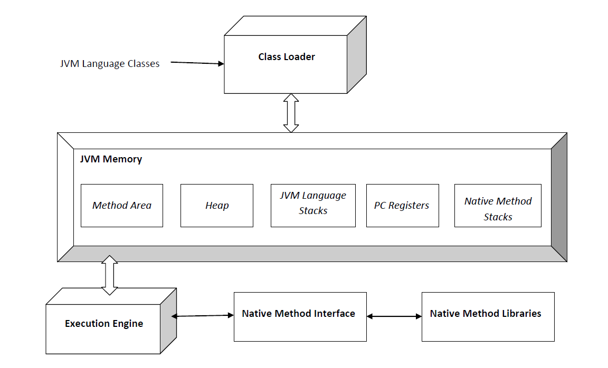
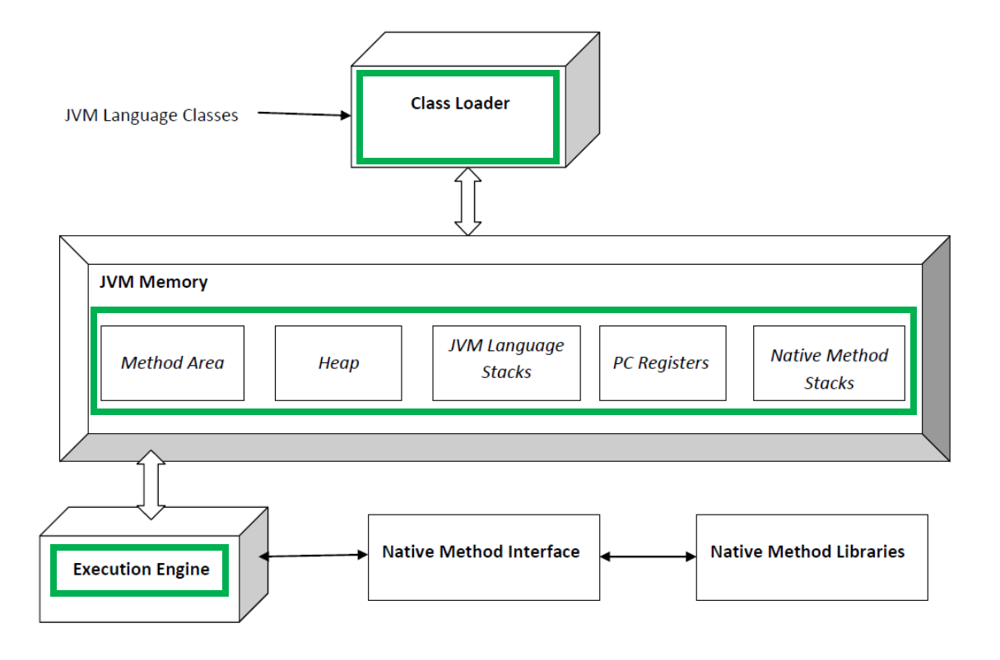

# JVM의 각 모듈들

 

# Java 코드가 컴파일되고 바이트코드가 기계어로 변환되어 실행되는 과정

요약하자면 아래와 같은 과정을 거친다. 

- JAVA 소스코드는 javac 라는 자바 컴파일러로 바이트코드로 컴파일한다. (.class 파일이 생성된다.)

- JRE ClassLoader 는 JVM에 바이트코드를 적재한다. (JRE Class Loader -> JVM)

- JVM 의 실행엔진(Execution Engine)은 바이트코드를 기계어로 변환하고 명령어 단위로 실행하는 역할을 수행한다.
  - (이때, 바이트 코드를 기계어로 변환할 때 사용하는 것이 JIT 컴파일러 또는 인터프리터다.)

 

# JVM의 각 모듈들의 구성

클래스로더, 런타임 데이터 영역, 실행엔진, 가비지컬렉터 으로 구성된다.

 

- **JVM의 클래스 로더**는 .class 파일 같은 바이트 코드를 JVM으로 적재한다. 정확히는 JVM의 런타임 데이터 영역에 적재한다. (정확히는 JRE의 ClassLoader)
- **JVM의 런타임 데이터 영역** (Runtime Data Area) 은 Method Area, 힙 영역, PC Register, Native Method Stack 으로 구성된다.
  - Method Area, 힙 영역, PC Register, Native Method Stack
- **JVM의 실행 엔진**(Execution Engine)은 바이트코드를 기계어로 변환해 실행하는 역할을 수행한다. 기계어로 변환할 때 인터프리터나 JIT컴파일러를 사용한다.
- **가비지 컬렉터**(GC) 는 Major GC, Minor GC로 분류된다.

 

# 클래스 로더 (Class Loader)

- .java 형태의 파일을 컴파일하면 .class 파일이 생성된다.
- 클래스로더는 이렇게 생성된 클래스 파일들을 엮어서 Runtime Data Area 로 적재하는 역할을 수행한다.
- Runtime Data Area 는 JVM이 운영체제로부터 할당받은 메모리 영역이다.

 

# 런타임 데이터 영역 (Runtime Data Area)

- Method Area, 힙 영역, 스택 영역, PC Register, Method 스택 으로 구성되어 있다.
- JVM 의 메모리 영역이다.
- 클래스로더는 런타임 데이터 영역에 .class 파일을 적재한다.

 

# 실행엔진 (Execution Engine)

- 클래스 로더가 Runtime Data Area 에 적재한 클래스(바이트코드)를 기계어로 변경해서 명령어 단위로 실행하는 역할을 수행한다.
- 명령어를 하나 하나 실행하는 인터프리터(interpreter) 방식, JIT(Just In Time) 컴파일러를 이용하는 방식이 있다.

 

# 가비지 컬렉터 (Garbage Collector, GC)

- Heap 메모리 영역에 생성(적재)된 객체 들 중에 참조되지 않는 객체들을 탐색 후 제거하는 역할을 수행한다.
- GC가 동작하는 시점은 정확히 알 수 없다.
- GC가 수행되는 동안 GC를 수행하는 스레드가 아닌 모든 스레드가 일시정지 된다.
- Full GC가 일어나서 몇 초간 모든 스레드가 정지하게 되면 장애로 이어지는 치명적인 문제가 발생할 수 있다.

 