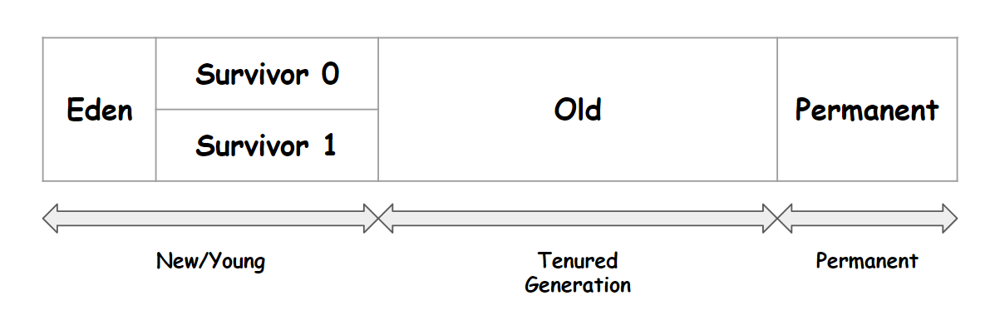
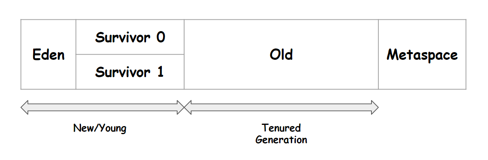

# 0. JVM의 힙 영역 메모리 구조

이번 문서에서 정리하는 힙 영역은 JVM의 각 모듈들에서 아래그림에서 초록색 테두리로 표시해둔 부분이다.

 

힙 메모리에서의 GC 가 동작하는 흐름은 아래와 같다. 이 그림은 [https://1-7171771.tistory.com/140](https://1-7171771.tistory.com/140) 에서 가져왔는데, 그림의 원본이 어디인지 찾아보다가 결국 포기했다. 그래서 그림의 출처를 이번 글에 포함하지 못했다. 구글이미지 검색으로 찾아봤을 때 아래 그림보다 더 직관적으로 설명하는 그림이 없어서 출처가 불명확하지만 가져왔다. 

 

# 참고자료

- JVM 구조와 자바 런타임 메모리 구조 : [https://jeong-pro.tistory.com/148](https://jeong-pro.tistory.com/148)
- JAVA 8 이후의 HEAP 메모리 구조와 GC 알고리즘 : [https://1-7171771.tistory.com/140](https://1-7171771.tistory.com/140)
- JAVA 8 부터는 static 이 heap 영역에 저장된다? : [https://jgrammer.tistory.com/144](https://jgrammer.tistory.com/144)
- JEP 122: Remove the Permanent Generation : [https://openjdk.org/jeps/122](https://openjdk.org/jeps/122)
- Stack 과 Heap, 그리고 Garbate Collection : [https://medium.com/@lunay0ung/stack-vs-heap-a0a0fe5ec5ce](https://medium.com/@lunay0ung/stack-vs-heap-a0a0fe5ec5ce)
- JDK 8 에서 Perm 영역은 왜 삭제됐을까 : [https://johngrib.github.io/wiki/java8-why-permgen-removed/](https://johngrib.github.io/wiki/java8-why-permgen-removed/)
- [자바 트러블 슈팅](http://www.yes24.com/Product/Goods/84937877)
- G1GC : [https://www.oracle.com/technetwork/tutorials/tutorials-1876574.html](https://www.oracle.com/technetwork/tutorials/tutorials-1876574.html)
- The Java Virtual Machine Specification - 2.5 Runtime Data Area : [https://docs.oracle.com/javase/specs/jvms/se11/html/jvms-2.html#jvms-2.5](https://docs.oracle.com/javase/specs/jvms/se11/html/jvms-2.html#jvms-2.5)

 

# 요약

힙 영의 주요 메모리 영역들

- New/Young, Old, Permanent 또는 Metaspace 영역으로 구분된다.
- New/Young 영역:
  - Eden, Survivor0, Survivor1 영역으로 구성된다.
- Old 영역
  - Eden, Survivor0,1 에 담아두지 못하는 객체이거나, 오랫동안 생존에 성공한 객체는 Old 영역으로 이동된다.
- Permanent 영역
  - 클래스 메타데이터, Method 메타데이터, 스태틱 변수/상수, JIT, JVM 관련데이터 들에 대한 영역
  - Java 8 이후로는 사용하지 않는 영역이다.
- Metaspace 영역(Native 메모리 영역)
  - Java 8 이후부터 Permanent 영역이 제거되고, Metaspace 라는 영역이 새로 생겼다.
  - Native 메모리 영역이라고도 불린다.
  - Native 메모리 영역이라 하는 것은 Native 레벨에서 관리된다는 것으로 JVM이 관리하는 것이 아닌 OS레벨에서 관리되는 메모리를 의미한다.
  - Java 8 이전에 permanent에서 관리하던 class meta data 들을 Metaspace(=native 메모리 영역)에서 관리하게 되었다.
  - Java 8 이후부터는 Java8 이전에 permanent 영역에서 관리하던 아래의 데이터들은 모두 Java Heap 에서 관리하게끔 변경됐다.
    - (class meta data 를 제외한 나머지 데이터들은 모두 JAVA Heap 영역에서 관리하게끔 변경됨)
    - interned String, class static 변수/상수

 

# Java 8 이전의 Heap 영역 구조 -> Java 8 이후의 Heap 영역 구조

그림을 보면 알 수 있듯이 아래와 같이 요약가능하다.

- Eden, Survivor0, Survivor1, Old 영역은 그대로 Java8 이전/이후 모두 존재한다.
- Java 8 이전에는 Permanent 라는 영역은 Java 8 이후부터는 없어지고, Metaspace 라는 영역이 새로 생겼다.
  - Java 8 이후부터는 Permanent 영역에서 관리하던 데이터 중 
    - class meta data 만 Metaspace 에서 관리하고
    - 나머지는 모두 Java Heap 에서 관리하게끔 변경되었다.

 

**Java 8 이전의 Heap 영역 구조**

 

**Java 8 이후의 Heap 영역 구조**

 

# New/Young 영역 (Eden, Survivor 0, Survivor 1)

메모리에 객체가 생성되면 Eden 영역에 객체가 지정된다. 

Eden 영역에 데이터가 가득차면 Eden 영역에 있던 객체는 Survivor0, Survivor1 둘 중 하나로 옮겨진다. 

Eden 영역에서 Survivor0, Survivor1 둘 중 하나로 옮겨지는 객체들은 어딘가에서 참조되고 있는 객체들이다. 

(* Survivor0, Survivor1 사이에 우선순위가 있지는 않다. Survivor0이 가득차면 Survivor1에 넣어두거나, Survivor1이 가득차면 Survivor0에 넣어둔다.) 

 

# Minor GC

New/Young 영역에서 발생하는 GC다. 

Eden, Survivor0, Survivor1 영역에서 사용되지 않는 객체들을 삭제하는 것을 Minor GC라고 부른다. 

 

# Old 영역

New/Young 영역 (Survivor0, Survivor1, Eden 영역) 에서 오랫동안 살아남은 객체들은 Old 영역으로 이동한다. 보통 Old 영역은 New/Young 영역 보다 크게 할당한다. 

Old 영역은 New/Young 영역보다 크게 할당하기 때문에 Old 영역에서는 New/Young 영역보다 GC가 적게 발생한다. 

**객체의 크기가 아주 클 경우** New/Young 영역에서 Survivor0, Survivor1 영역을 거치지 않고 Eden 영역에서 바로 Old 영역으로 넘어가는 경우가 있다. 

이런 경우는 예를 들면 Survivor 영역의 크기가 20MB 인데 객체의 크기가 24MB일 경우를 예로 들 수 있다. 

 

**객체가 오래 살아남았음을 판단하는 기준** 

Eden, Survivor0, Survivor1 에서 오래 살아남은 객체는 Old 영역으로 이동시킨다. 오래 살아남았다는 것을 판단하는 기준은 아래와 같다. 

- Young Generation 영역에서 살아남는 객체는 Minor GC로부터 살아남을 때마다 age bit 이 1씩 증가한다.
- Young Generation 영역에서 Minor GC 로부터 얼마나 오랫동안 살아남았는지를 체크한다.  
- 그리고 이 age bit 값이 `MaxTenuringThreshold` 라는 임계값을 의미하는 설정값을 초과하면 Old 영역으로 이동된다. 

조금 길게 쓰긴 했는데, 요약해보면 아래와 같이 한 문장으로 요약할 수 있다.

- Young 영역의 객체의 age bit 가 MaxTenuringThreshold 라는 임계값을 넘어서면 오래 살아남은 것으로 간주하고, Old 영역으로 이관한다.
- age bit 는 Minor GC에서 살아남을 때마다 1 씩 증가한다.

 

# Major GC (Full GC)

Old 영역에서는 2차 GC라고도 불리는 `Major GC` 가 발생한다.  

GC 작업을 진행하는 Thread를 제외하고 그 외의 모든 Thread를 멈춘 후 GC를 진행한다. 

이때 GC를 수행하는 Thread 외의 모든 Thread가 멈추는 상태를 `Stop the world` 라고 부른다. 

 

GC알고리즘을 어떤 것을 사용하더라도 `Stop the world` 를 피하는 것은 불가능하다. 

GC튜닝을 하는 목적이 바로 `Stop the world` 에 소요되는 시간을 최소한으로 줄이기 위함이다. 

 

# Minor GC, Major GC, 객체의 생존 흐름

힙 메모리에서의 GC 가 동작하는 흐름은 아래와 같다. 이 그림은 [https://1-7171771.tistory.com/140](https://1-7171771.tistory.com/140) 에서 가져왔는데, 그림의 원본이 어디인지 찾아보다가 결국 포기했다. 그래서 그림의 출처를 이번 글에 포함하지 못했다. 구글이미지 검색으로 찾아봤을 때 아래 그림보다 더 직관적으로 설명하는 그림이 없어서 출처가 불명확하지만 가져왔다. 

이 글의 상단에 요약하듯이 정리한 내용인데, 마무리하면서도 정리하면 좋을 것 같아 마무리 글에도 복붙을 해두었다. 

 

