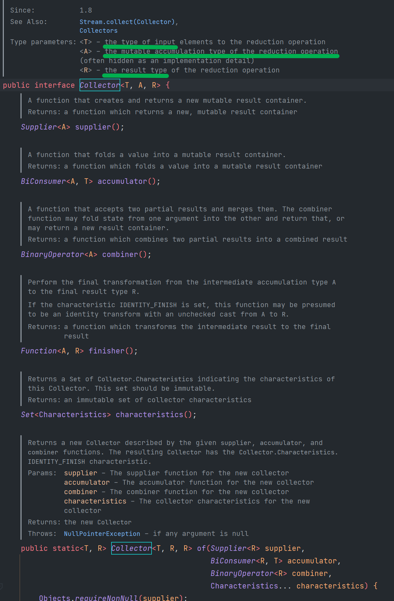
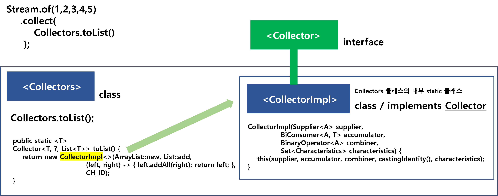
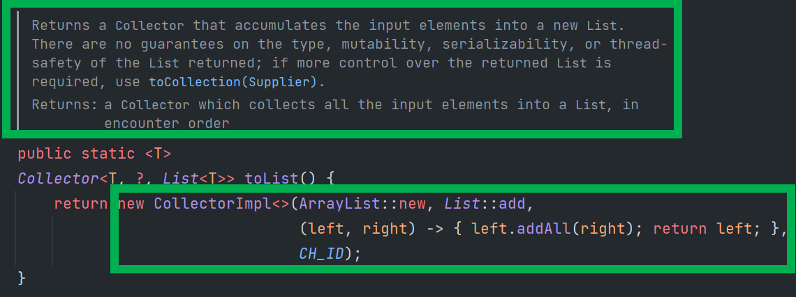

# Collectors


# Stream::collect() 메서드

Stream은 collect 메서드를 제공한다. collect 메서드의 원형은 아래와 같다.

이 중에서 오늘 예제로 정리할 collect 메서드는 첫번째 collect 메서드다.


<br>

이 collect 메서드는 Collector 라는 객체를 받아들인다. Collector 는 인터페이스이다.<br>

Collector 인터페이스의 원형은 아래와 같다.<br>

<br>



자세히 보면, 이펙티브 메서드에서 이야기하는 `of` 라는 이름 규칙을 가진 정적 팩토리 메서드도 보인다.<br>

<br>

# Collectors::toList() - Stream 을 List로 변환

예제 자체는 어렵지 않다.

```java
@Test
@DisplayName("Stream 을 Collectors 를 이용해 List 로 변환")
public void TEST_COLLECTORS_TO_LIST(){
    // 숫자들이 나열된 스트림을 Integer List 로 변환
    List<Integer> list = Stream.of(99, -1, 5, 3, 2)
            .collect(Collectors.toList());

    System.out.println(list);
}
```

출력결과

```java
[99, -1, 5, 3, 2]
```

<br>

# Collectors::mapping()

```java
@Test
@DisplayName("Collectors 의 mapping 을 사용해보기")
public void TEST_COLLECTORS_MAPPING(){
    // Collectors.mapping 을 사용해보기
    List<Integer> mapping_toList1 = Stream.of(99, -1, 5, 3, 2)
            .collect(Collectors.mapping(x -> Math.abs(x), Collectors.toList()));

    System.out.println("list = " + mapping_toList1);

    // Collectors.mapping 을 사용한 것을 Set으로
    Set<Integer> mapping_toSet = Stream.of(99, -1, 5, 1, 2)
            .collect(Collectors.mapping(x -> Math.abs(x), Collectors.toSet()));

    System.out.println("toSet with Collectors.mapping() >> " + mapping_toSet);

    // x -> x 는 Function.identity() 바꾸는 것이 가능하다.
    List<Integer> mapping_toList4 = Stream.of(99, -1, 5, 3, 2)
            .collect(Collectors.mapping(Function.identity(), Collectors.toList()));
}
```

출력결과

```java
list = [99, 1, 5, 3, 2]
toSet with Collectors.mapping() >> [1, 2, 99, 5]
```

<br>

# Collectors::reducing()

```java
@Test
@DisplayName("Collectors 의 reducing 을 사용해보기")
public void TEST_COLLECTORS_REDUCING(){
    Integer sum = Stream.of(99, -1, 3, 5, 1)
            .collect(Collectors.reducing(0, (x, y) -> x + y));
    System.out.println(sum);
    // Collectors.reducing(T, BinaryOperator)
            // BinaryOperator ...
}
```

출력결과

```java
107
```

<br>

# Collectors 의 주요 메서드들

## Collectors.toList(),toMap(), toSet()

이래저래 설명을 막 쓰고 지우고 하면서 30분에서 40분정도 소모했는데, 파워포인트로 아래의 UML을 그리고 나니, 다른 작업이 필요없어졌다. 역시 단순하게 생각해야한다. 어렵게 생각하면 끝도 없다.<br>

<br>



<br>

조금의 설명을 부연하면 이렇다.

```java
Stream.of(1,2,3,4,5).collect(Collectors.toList());
```

위의 코드를 실행할 때 사용되는 Collectors.toList 메서드는 Collector 타입을 만들어서 반환한다.<br>

이 Collector 는 인터페이스이고, 이것을 구현한 구현체(implements)는 CollectorImpl 클래스가 있다.<br>

Collector 라는 인터페이스로 규약을 만들었으니, 이것을 implements 해서 자료형으로 만들어서 반환해야 한다.<br>

이렇게 implements 한 구현체는 Collectors 클래스 내부에서 static inner 클래스로 선언되어 있다.<br>

<br>

```java
public final class Colelctors{

	/**
		Simple implementation class for Collector.
		Type parameters:
		<T> – the type of elements to be collected
		<R> – the type of the result
		*/
	static class CollectorImpl<T, A, R> implements Collector<T, A, R> {
		// ...
	}
}
```

<br>

toList() 메서드에서 중요하게 알아둬야 할 내용이 있긴 하다.<br>

toList() 메서드가 리턴하는 Collector 는 리스트로 accumulate 하는 역할을 한다. 여기에서 type,mutability, serializability, thread-safty 가 보장되는 List를 리턴하지는 않는다.<br>



<br>

