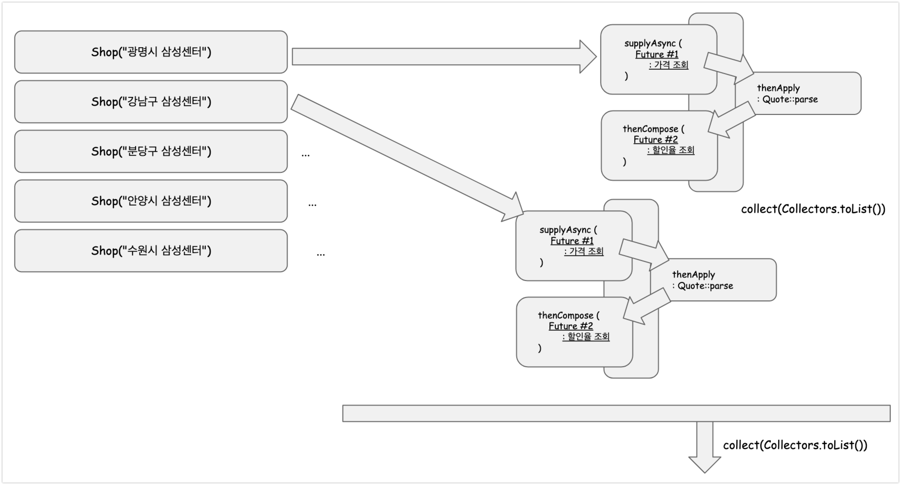

# 16.4-16.5 비동기 작업 파이프라인 만들기

예제 소스에 대한 설명은 16.4-예제코드-정리.md 에 정리해두었다.<br>

<br>

## 목차

- [참고자료](#참고자료)<br>
- [Overview](#overview)<br>
- [문제의 코드](#문제의-코드)<br>
  - [출력결과](#출력결과)<br>
- [커스텀 Executor 생성하기](#커스텀-executor-생성하기)<br>
- [두 가지 비동기 연산을 thenCompose 로 비동기 파이프라인으로 만들어 처리해보기](#두-가지-비동기-연산을-thencompose-로-비동기-파이프라인으로-만들어-처리해보기)<br>
  - [call-flow](#call-flow)<br>
  - [테스트코드 - thenCompose 를 이용한 비동기파이프라인](#테스트코드---thenCompose-를-이용한-비동기-파이프라인)<br>
  - [1) supplyAsync(Supplier, Executor)](#1--supplyasync(supplier--Executor-))<br>
  - [2) thenApply(Funciton)](#2--thenapply-funciton-)<br>
  - [3) thenCompose(Function)](#3--thencompose-function-)<br>

<br>

## 참고자료

- [모던 자바 인 액션](http://www.yes24.com/Product/Goods/77125987)<br>
- [docs.oracle.com/javase - CompletableFuture](https://docs.oracle.com/javase/8/docs/api/java/util/concurrent/CompletableFuture.html)
- [devidea.tistory.com/34 - CompletableFuture 정리](https://devidea.tistory.com/34)<br>

<br>

## Overview

어떤 내용을 배우게 될지 정리하지 않고, 무작정 독자가 따라서 읽게끔 하는 것은 조금은 불친절한게 아닐까하는 생각이 들었다. [모던 자바 인 액션](http://www.yes24.com/Product/Goods/77125987) 책이 실제로 그렇다. 일단 이번 챕터를 정리하기 전에 어떤 메서드들을 다루게 되는지 등을 먼저 문서 초입에 요약을 잘 해놓아야 할 것 같다.<br>

<br>(정리 필요!!!)

- `CompletableFuture::supplyAsync(Supplier<U> supplier)` <br>
  - Returns a new CompletableFuture that is asynchronously completed by a task running in the [`ForkJoinPool.commonPool()`](https://docs.oracle.com/javase/8/docs/api/java/util/concurrent/ForkJoinPool.html#commonPool--) with the value obtained by calling the given Supplier.
- `CompletableFuture::supplyAsync(Supplier<U> supplier, Executor executor)` <br>
  - Returns a new CompletableFuture that is asynchronously completed by a task running in the given executor with the value obtained by calling the given Supplier.
- `CompletableFuture::thenApply` <br>
  - `thenApply(Function \<? super T, ? extends U\> fn)` <br>
  - Returns a new CompletionStage that, when this stage completes normally, is executed with this stage's result as the argument to the supplied function.
- `CompletableFuture::thenCompose` <br>
  - `thenCompose(Function\<? super T, extends CompletionStage\<U\>\> fn)` <br>
  - Returns a new CompletionStage that, when this stage completes normally, is executed with this stage as the argument to the supplied function.
- `CompletableFuture::thenCombine` <br>
  - `thenCombine(CompletionStage\<? etends U\> other, BiFunction\<? super T, ? super U, ? extends V\> fn)` <br>
  - Returns a new CompletionStage that, when this and the other given stage both complete normally, is executed with the two results as arguments to the supplied function.
- `orTimeout` , `completeOnTimeout` <br>
  - 타임아웃 효과적으로 사용하기<br>

<br>

## 문제의 코드

가게 5개에 대해서 "myphone" 이라는 물건의 가격과 할인율을 조회한다. 이 때 조회하는 함수들은 아래와 같다.<br>

- 처리속도가 1초인 getPrice(String product)<br>
- 처리속도가 1초인 applyDiscount(Quote qoute)<br>

<br>

기대되는 수행시간은 10000ms, 즉, 10초 가량이다.

```java
package io.study.modernjavainaction.ch16;

import io.study.modernjavainaction.ch16.discount.Discount;
import io.study.modernjavainaction.ch16.discount.Quote;
import io.study.modernjavainaction.ch16.shop.Shop;
import java.util.*;
import java.util.stream.Collectors;
import org.junit.jupiter.api.DisplayName;
import org.junit.jupiter.api.Test;

public class AsyncPipelineTest_16_4 {

	List<Shop> shops = Arrays.asList(
		new Shop("광명시 삼성센터"),
		new Shop("강남구 삼성센터"),
		new Shop("분당구 삼성센터"),
		new Shop("안양시 삼성센터"),
		new Shop("수원시 삼성센터")
	);

	public List<String> findPrices(String product){
		return shops.stream()
			.map(shop -> shop.getPrice(product))
			.map(Quote::parse)
			.map(Discount::applyDiscount)
			.collect(Collectors.toList());
	}

	@DisplayName("문제예제1_동기식으로_값_조회와_할인율계산을_한꺼번에_수행하기")
	@Test
	void 문제예제1_동기식으로_값_조회와_할인율계산을_한꺼번에_수행하기(){
		long start = System.nanoTime();
		List<String> results = findPrices("myphone");
		long duration = (System.nanoTime() - start) / 1000000;
		System.out.println("[완료] " + duration + " ms");
	}
}
```

<br>

실제로 최종적으로 수행되는 시간은 10초(10000ms)가 소요되게 된다.<br>

### 출력결과

```plain
[완료] 10064 ms
```

<br>

## 커스텀 Executor 생성하기

[모던 자바 인 액션](http://www.yes24.com/Product/Goods/77125987) 에서 제공하는 Executor 는 스레드 풀 등의 크기 등에 대해 크게 의미를 부여해 만들어진 Executor는 아니지만, 책에서 직접 사용한 커스텀 Executor 를 사용해봤다.<br>

```java
private final Executor executor =
  Executors.newFixedThreadPool(Math.min(shops.size(), 100), new ThreadFactory(){
    public Thread newThread(Runnable r){
      Thread t = new Thread(r);
      t.setDaemon(true);
      return t;
    }
  });
```

<br>

스레드 풀의 개념에 대해서는 16.3 에서 따로 정리할 예정이다.<br>

<br>

## 두 가지 비동기 연산을 thenCompose 로 비동기 파이프라인으로 만들어 처리해보기

[모던 자바 인 액션](http://www.yes24.com/Product/Goods/77125987) 에서는 이 부분을 16.4.3 에서 3 페이지 가량에 걸처 설명하고 있다. 이 내용을 더 줄여서 요약할 수 있을지는 아직 자신이 없지만 정리를 시작해보려 한다.<br>

<br>

### call-flow

구글 독스의 파워포인트에서 그려본 그림이다. 잘 그리지는 못했다. 그림실력이 좋지 않다. 전체적인 콜 플로우는 아래와 같다.<br>



<br>

### 테스트코드 - thenCompose 를 이용한 비동기 파이프라인

```java
package io.study.modernjavainaction.ch16;

public class AsyncPipelineTest_16_4 {

	List<Shop> shops = Arrays.asList(
		new Shop("광명시 삼성센터"),
		new Shop("강남구 삼성센터"),
		new Shop("분당구 삼성센터"),
		new Shop("안양시 삼성센터"),
		new Shop("수원시 삼성센터")
	);

	private final Executor executor =
		Executors.newFixedThreadPool(Math.min(shops.size(), 100), new ThreadFactory(){
			public Thread newThread(Runnable r){
				Thread t = new Thread(r);
				t.setDaemon(true);
				return t;
			}
		});
  
	@DisplayName("예제2_두가지_비동기_연산을_thenCompose()_메서드를_이용해_파이프라인으로_만들어서_처리해보기")
	@Test
	void 예제2_두가지_비동기_연산을_thenCompose_메서드를_이용해_파이프라인으로_만들어서_처리해보기(){
		long start = System.nanoTime();
		String product = "myphone";

		List<CompletableFuture<String>> priceStrFutures = shops.stream()
			.map(shop -> CompletableFuture.supplyAsync(() -> shop.getPrice(product), executor))
			.map(future -> future.thenApply(Quote::parse))
			.map(future -> future.thenCompose(
				quote -> CompletableFuture.supplyAsync(
					() -> Discount.applyDiscount(quote), executor)
			))
			.collect(Collectors.toList());

		priceStrFutures.stream()
			.map(CompletableFuture::join)
			.collect(Collectors.toList());

		long duration = (System.nanoTime() - start) / 1000000;
		System.out.println("[완료] " + duration + " ms");
	}
}
```

<br>

출력결과

```plain
[완료] 2056 ms
```

 순차적으로 모두 처리할 경우 10초가 걸려야 하는데, 2초 만에 처리가 완료되었다. 아래에서부터는 위의 코드를 설명하면서 CompletableFuture에서 제공하는 API에 대해서도 정리해볼 예정이다.<br>

<br>

### 1) supplyAsync(Supplier, Executor)

> Executor 객체로 Supplier 람다를 실행시켜 CompletableFuture 태스크를 비동기적으로 완료시킨다.<br>

<br>

CompletableFuture의 `supplyAsync` 는 이전에서 살펴봤었었다. `supplyAsync`  의 역할을 간단하게 요약해보면 아래와 같다.<br>

- `supplyAsync 메서드`는 팩토리 메서드이다. `CompletableFuture` 인스턴스를 생성한다.<br>
- supplyAsync 메서드는 Supplier 를 인수로 받는다.<br>
- supplyAsync의 역할은 아래의 두가지이다.
  - `CompletableFuture` 인스턴스를 생성하는 팩토리 메서드 역할<br>
  - 전달받은 Executor 객체로 비동기적으로 Supplier 람다에 기술한 작업을 실행시켜 CompletableFuture 태스크를 완료시킨다.<br>
- 그리고, CompletableFuture를 반환한다.<br>
- supplyAsync는 CompletableFuture 클래스 내에서 아래의 두가지 형태의 메서드 들로 오버로딩되어 있다. <br>
  - `supplyAsync (Supplier <U> supplier)` <br>
  - `supplyAsync (Supplier <U> supplier, Executor executor)` <br>
    - `supplyAsync (Supplier <U> supplier, Executor executor)`  의 경우 직접 커스터마이징한 Executor 를 인자로 전달해서 지정할 수 있다.<br>

<br>

위에서 사용한 예제에서 supplyAsync 를 통해 completableFuture 인스턴스를 생성하는 부분은 아래와 같다.<br>


<br>

아래의 두개의 태스크를 supplyAsync를 통해 CompletableFuture 인스턴스로 생성했다.<br>

- 가격 조회 (shop.getPrice(String product)) <br>
- 할인율 조회 (Discount.applyDiscount(quote)) <br>

<br>

이 작업들은 2초내에 수행된다. 그리고 이 CompletableFuture 인스턴스는 shops의 갯수인 5개가 생성된다.<br>

<br>

### 2) thenApply(Function)

> Returns a new CompletionStage that, when this stage completes normally, is executed with this stage's result as the argument to the supplied function.<br>
>
> <br>
>
> 참고) [docs.oracle.com/.../CompletableFuture/thenApply](https://docs.oracle.com/javase/8/docs/api/java/util/concurrent/CompletableFuture.html#thenApply-java.util.function.Function-)<br>

TODO<br>

<br>

### 3) thenCompose(Function)

> Description copied from interface: `CompletionStage`<br>
>
> Returns a new CompletionStage that, when this stage completes normally, is executed with this stage as the argument to the supplied function.  See the [`CompletionStage`](https://docs.oracle.com/javase/8/docs/api/java/util/concurrent/CompletionStage.html) documentation for rules covering exceptional completion.<br>
>
> <br>
>
> 참고) [docs.oracle.com/.../CompletableFutur/thenCompose](https://docs.oracle.com/javase/8/docs/api/java/util/concurrent/CompletableFuture.html#thenCompose-java.util.function.Function-)<br>

TODO<br>

<br>