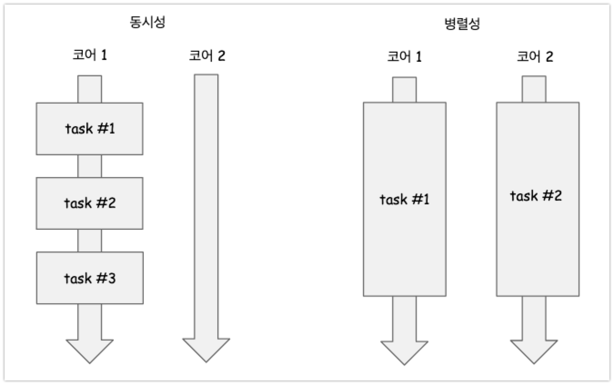

# 15.1 자바의 동시성 지원사항들의 변화들

**참고자료** : [모던 자바 인 액션](http://www.yes24.com/Product/Goods/77125987)<br>

<br>

## 목차

- [OVERVIEW](#overview)<br>
- [자바의 동시성 지원 스펙들의 변화](#자바의-동시성-지원-스펙들의-변화)
- [프로세스와 스레드](#프로세스와-스레드)
  - [프로세스 vs 스레드](#프로세스-vs-스레드)
  - [예제](#예제)
  - [추상화](#추상화)
- [Java 1.5 의  ExecutorService 개념과 스레드 풀](#Java-1-5-의-executorservice-개념과-스레드-풀)


## OVERVIEW

책의 설명이 정말 너무 좋지 않다. 문장 문장마다 요점이 없다. 이상하다. 다시 읽어볼때 이해하는데 한참이 걸릴 것 같아서 간단하게 요약을 해봐야 할 것 같다. 약간 사이비같은 요약이지만, 조금은 직관적이고 무식하게 정리해봐야 할 것 같다.<br>

<br>

**병렬성(Parallelism) - 포크/조인 프레임워크, 병렬스트림 (7장)**<br>

- 병렬 스트림, 포크/조인 프레임워크로 구현 가능하다. (7장에서 설명하고 있다.)<br>
- 하나의 작업을 하나의 CPU에서 돌리고 그 동안 다른 작업도 다른 코어에서 돌리고 이런 방식을 병렬성이라고 한다.<br>
- 병렬 스트림, 포크/조인 프레임워크를 사용할 때 태스크를 여러 개의 하위 태스크로 나누어서 각각 병렬로 실행하는 것을 의미한다.<br>

<br>

**동시성(Concurrency) - CompletableFuture**<br>

- CompletableFuture 로 구현가능하다.<br>
- 유사하고, 연관된 작업들을 **같은 CPU** 에서 동작하도록 하려고 할때 사용한다.<br>
- 병렬 프로그래밍의 경우 여러 작업으로 나눠 작업을 여러개의 CPU에 분산했다면 CompletableFuture의 동시성 개념은 하나의 CPU를 최대한 효율적으로 모두 사용하기 위한 것을 위한 개념이다.<br>

<br>

병렬성과 동시성 개념의 차이를 그림으로 직접 그려서 정리한 내용은 아래와 같다.<br>



<br>

## 자바의 동시성 지원 스펙들의 변화

**초창기 Java**<br>

Runnable, Thread 를 동기화된 클래스, 메서드로 잠갔다.<br>

<br>

**Java 5**<br>

- 2004 년 부터는 제너릭이 도입되었고, Runnable, Thread 의 변형을 반환하는 라이브러리들이 추가되었다.<br>
- 좀 더 표현력 있는 동시성 지원하는 ExecutorService, Callable\<T\>, Future\<T\> 을 지원하기 시작.<br>
- Callable\<T\>, Future\<T\> 의 경우 Runnable, Thread 의 조금 더 높은 수준의 변형을 반환한다.<br>

**Java 7**<br>

- `java.util.concurrent.RecursiveTask` 가 추가되었다.<br>
- RecursiveTask는 분할/정복 알고리즘의 포크/조인 구현을 지원한다.<br>

**Java 8**<br>

- 스트림, 람다 기반의 병렬 프로세싱 기능 추가<br>
- Future 를 조합하는 기능을 추가하면서 동시성관련 기능들을 강화했다. (15.4, 16장의 CompletableFuture 참고)<br>

**Java 9**<br>

- 분산 비동기 프로그래밍을 명시적으로 지원하기 시작했다.<br>
- 매시업 애플리케이션 및 다양한 웹 서비스들과 연동하는 시스템에서는 보통 응답을 기다리는 데에 소모되는 비용이 있는데, 이런 경우에 사용할 수 있는 기초모델, 툴킷을 제공하고 있다.<br>
- 이 과정을 `리액티브 프로그래밍` 이라고 부른다.<br>
- Java 9 에서는 이것을 발행-구독 프로토콜로 이것을 지원한다.<br>
- java.util.concurrent.Flow 인터페이스 추가<br>
- ※ CompletableFuture, java.util.concurrent.Flow 의 궁극적인 목표는 동시에 실행할 수 있는 독립적인 태스크를 가능하게 만들면서 멀티코어 또는 여러 기기를 통해 제공되는 병렬성을 쉽게 이용하는 것이다.<br>

<br>

## 프로세스와 스레드

15.1.1 스레드와 높은 수준의 추상화 에 해당하는 내용을 정리한다. 이번 장 역시도 [모던 자바 인 액션](http://www.yes24.com/Product/Goods/77125987)의 내용이 너무나도 횡설수설인 관계로 고통을 너무나 많이 받아서, 최대한 요약을 해서 정리해볼까 한다.<br>

### 프로세스 vs 스레드

**프로세스**<br>

프로세스에 대한 설명은 명확하게 설명되어 있지는 않다. 간접적이고 함축적으로 설명한 것을 유추해서 요약해보면, 저자는 프로세스를 **"CPU 하나에서 실행되는 존재"** 라고 표현하기 위해 노력한 것 같다. <br>

- 프로세스 하나는 CPU 하나에서 실행된다.<br>
- 여러개의 프로세스가 같이 실행되는 것처럼 느껴지는 것은 운영체제가 주기적으로 번갈아가면서 각 프로세스에 CPU를 할당하기 때문이다.<br>

<br>

**스레드**<br>

프로세스는 운영체제에 한 개 이상의 스레드를 생성하도록 요청해서 태스크를 스레드와 동시에 또는 협력적으로 실행할 수 있다.<br>

- 멀티 코어 환경에서는 스레드를 여러개 생성해서 여러 개의 코어를 골고루 사용할 수 있다.<br>

<br>

### 예제

[모던 자바 인 액션](http://www.yes24.com/Product/Goods/77125987) 에서는 단적인 예를 들어서 병렬 수행과 일반적인 순차적인 수행의 차이점을 설명하고 있다. 개인적인 취향으로는 예제가 마음에 들지는 않지만, 일단 정리해두었다.<br>

학생들의 점수가 100만개가 있다고 해보자. 이 100만개의 점수들은 stats[i] 에 저장되어 있다. <br>

이것 들의 합계를 구한다고 해보자.<br>

이것을 순차적으로 실행할경우 아래와 같이 구할 수 있다.<br>

```java
long sum = 0;
for(int i=0; i<1000000; i++){
  sum += stats[i];
}
```

이 연산을 돌리려는 컴퓨터의 CPU가 10GHz의 주파수를 가지고 있다고 해보자. CPU가 10GHz의 클록을 가지고 있다고 할때 1ns 에 하나의 클록이 소비된다. 이 때 대입 연산을 제외하고 for 문 하나에 대해서만 연산을 측정해보려고 한다. 이런 기준으로 계산을 한다면 `100만 x 1ns` 이다. 즉, 전체 연산에 소요되는 값은 `100만 ns` 이다.<br>

<br>

그런데 이 100만 개의 점수들을 4 등분해서 25만 개씩 구간을 나누어서 각각의 합을 구해놓기로 했다. 예를 들면 첫번째 구간의 경우는 연산이 아래와 같이 된다.<br>

```java
long sum0 = 0;
for(int i=0; i<250000; i++){
  sum0 = sum0 + stats[i];
}
```

<br>

그리고 마지막 구문의 경우는 아래와 같다.<br>

```java
long sum3 = 0;
for(int i=750000; i<1000000; i++){
  sum0 = sum0 + stats[i];
}
```

<br>

이 네 개 구간에 대한 각각의 스레드를 자바의 .start()로 각각 따로 실행한 다음 .join()으로 완료될 때까지 기다렸다가 아래의 내용을 계산한다.<br>

```java
sum = sum0 + sum1 + sum2 + sum3;
```

위와 같은 코드를 루프로 처리한다면 에러가 발생하기도 쉬워서 디버깅이 어려워진다. 루프가 아닐 경우에 대해서도 모두 하드코딩하기도 쉽지 않다.<br>

<br>

### 추상화

7장에서는 이런 경우에 대해 Java 스트림으로 루프(외부 반복) 대신 내부 반복을 통해 병렬수행을 보장할 수 있는 예제를 보여주고 있다.<br>

```java
sum = Arrays.stream(stats).parallel().sum();
```

[모던 자바 인 액션](http://www.yes24.com/Product/Goods/77125987) 에서는 for 문에서 스레드를 사용하는 것을 명시적으로 스레드를 사용한다고 표현한다. 또는 for문을 사용해 스레드를 돌리는 것을 명시적인 외부 반복이라고 표현한다.<br>

그리고 스트림과 parallel()을 사용해 반복을 하는 것을 내부반복이라고 부른다.<br>

<br>

## Java 1.5 의 ExecutorService 개념과 스레드 풀

(15.1.2 Executor와 스레드 풀)

